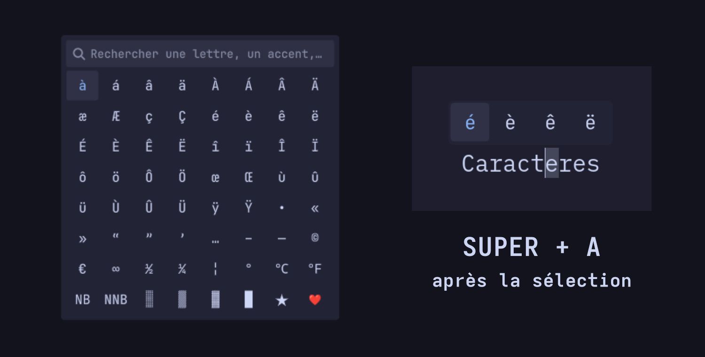

# Caractères français pour Omarchy

Un panneau compact pour saisir facilement les caractères français et typographiques depuis un clavier QWERTY US.



## Fonctionnalités

- Recherche instantanée (`e`, `a`, `guillemet`, `degré`, etc.)
- Copie d’un caractère depuis le panneau principal
- Remplacement direct d’une lettre sélectionnée par sa variante accentuée
- Variantes minuscules et majuscules séparées
- Ponctuation, espaces insécables, fractions, unités et symboles décoratifs
- Interface compacte adaptée au thème Omarchy

## Installation

```bash
omarchy plugin add https://github.com/SeanGSR/omarchy-french-characters.git --enable
```

Le bouton clavier apparaît ensuite dans la barre Omarchy et ouvre le panneau principal.

## Désinstallation

```bash
omarchy plugin remove fr.ldng.caracteres-francais --yes
```

Si vous avez ajouté le raccourci de sélection rapide ci-dessous, retirez également son bloc de `~/.config/hypr/bindings.lua`.

## Sélection rapide

Ajoutez ce raccourci à `~/.config/hypr/bindings.lua` :

```lua
o.bind(
  "SUPER + A",
  "Variantes de caractères français",
  os.getenv("HOME") .. "/.config/omarchy/plugins/fr.ldng.caracteres-francais/quick-selection"
)
```

Sélectionnez une lettre dans une application, puis utilisez `SUPER + A`. Le petit panneau ne montre que les variantes correspondantes. Cliquer sur une variante remplace directement la sélection sans conserver le caractère choisi dans l’historique du presse-papiers.

## Dépendances

- Omarchy Shell
- Hyprland
- `wl-clipboard`
- `wtype`
- `xdotool` (applications Wine/XWayland comme Affinity)
- `jq`

## English

A compact Omarchy panel for typing French and typographic characters on a US QWERTY keyboard. It provides instant search, clipboard copying, and a quick-selection mode that replaces a highlighted letter with the chosen accented variant.

## Licence

[MIT](LICENSE)
